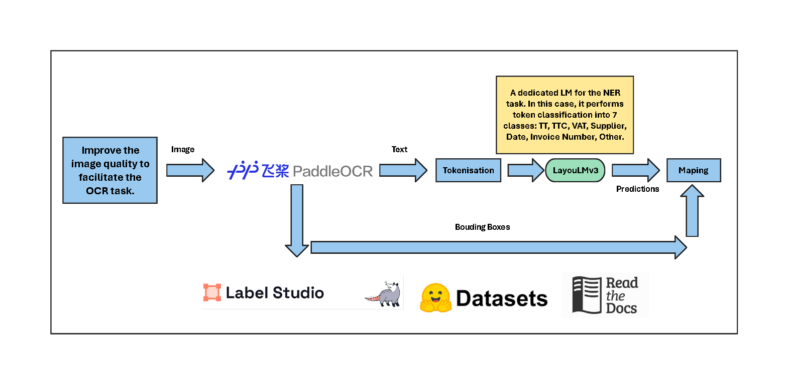

<p align="center">
    
</p>

# Textra

Welcome to the documentation repository for Textra tool. We combine OCR and NLP to extract useful information from images With height accuracy and speed.

## Inference Pipeline

<p align="center">
    
</p>

## Getting Started with Documentation Development

If you're interested in contributing to the documentation, follow these steps to set up your development environment:

### Prerequisites

Make sure you have Python installed on your system.

### Installation

1. Clone the repository to your local machine:

   ```bash
   git clone https://github.com/ITSAIDI/Textra.git
   ```

2. Navigate to the project directory:

   ```bash
   cd Textra
   ```

3. Install the required dependencies using pip:

   ```bash
   pip install -r requirements.txt
   ```

Now you're ready to start working on the documentation!

## Accessing the Documentation Online

The documentation is hosted on ReadTheDocs. You can access it online by following this [link](https://textra.readthedocs.io/fr/latest/).
