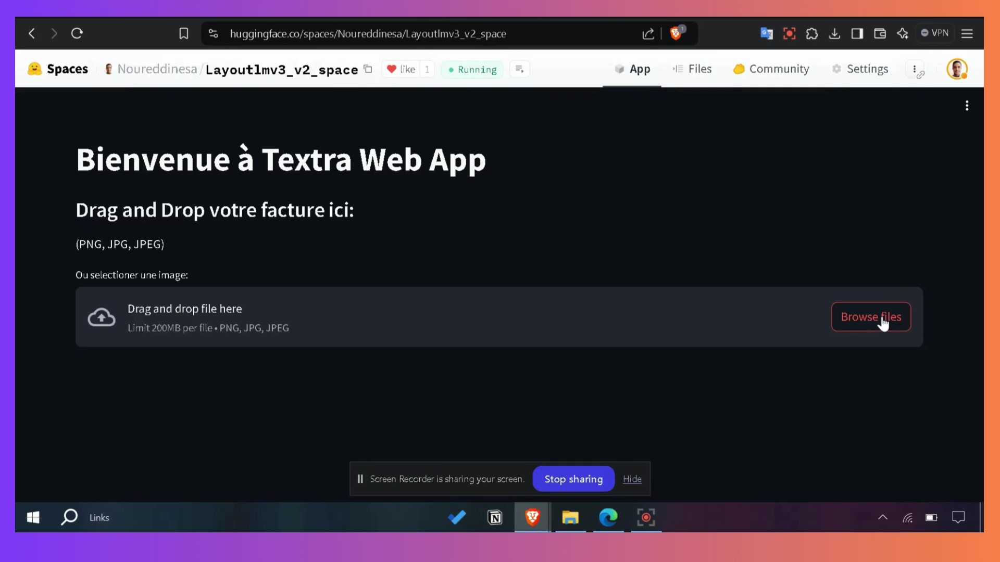

<p align="center">
    
</p>

<p align="center">
    <a href="https://huggingface.co/spaces/Noureddinesa/Layoutlmv3_v2_space" target="_blank">
        
    </a>
    <a href="https://textra.readthedocs.io/fr/latest/" target="_blank">
        
    </a>
    <a href="https://www.youtube.com/watch?v=1-orPAxxu6Q" target="_blank">
        
    </a>
</p>


# Textra

Welcome to the documentation repository for Textra tool. We combine OCR and NLP to extract useful information from french invoices With height accuracy and speed.

## Inference Pipeline

<p align="center">
    
</p>

## Demo

[](https://www.youtube.com/watch?v=1-orPAxxu6Q)

## Getting Started with Documentation Development

If you're interested in contributing to the documentation, follow these steps to set up your development environment:

### Prerequisites

Make sure you have Python installed on your system.

### Installation

1. Clone the repository to your local machine:

   ```bash
   git clone https://github.com/ITSAIDI/Textra.git
   ```

2. Navigate to the project directory:

   ```bash
   cd Textra
   ```

3. Install the required dependencies using pip:

   ```bash
   pip install -r requirements.txt
   ```

Now you're ready to start working on the documentation!
